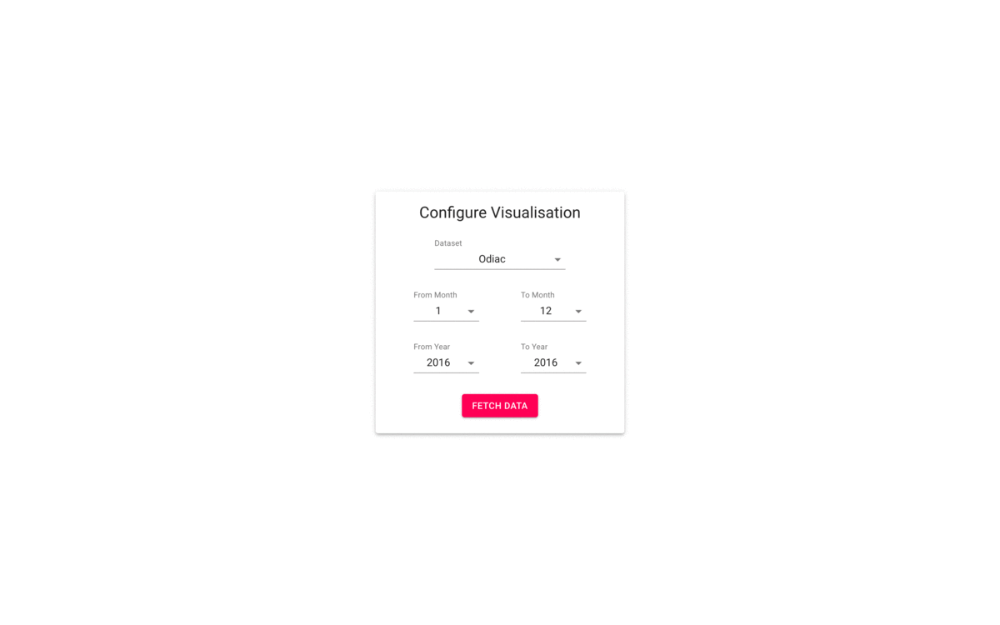

# Science Hack 2019 Website

### Remarks

See the official website at **https://science-hack-2019.herokuapp.com/** (container in sleep mode, startup might take a while ~ 20s).

Be patient with the data fetching -> no preprocessing done (using the exact edgar/odiac nc files).  
Since there is no preprocessing, the memory of the current (cost free) server is not big enough for large queries.

Select a date range and press `a`/`d` to jump backwards/forwards one time step. 
Press `space` to run the "player" = Loop through the timesteps.

 

### Tech Stack

* **Frontend: [React (JS)](https://reactjs.org/)**
* **Backend: [Flask (Python)](https://flask.palletsprojects.com/en/1.1.x/)**

 

* Using the **[Heroku](https://www.heroku.com/)** Pipline
* Hosted on **[AWS](https://aws.amazon.com/de/)**

 

* Map & Data Rendering using [**DeckGL**](https://deck.gl/)
* File Storage with **[Google Cloud Storage](https://cloud.google.com/products/storage)**

 

* Design Guideline by **[Google Material](https://material.io/)**
* React Design Components by **[Material UI](https://material-ui.com/)**
* With the help of **[SCSS](https://sass-lang.com/)**

### Planned Tech Stack

* Precomputed data in different scales delivered over **[Mongo DB Atlas](https://www.mongodb.com/cloud/atlas) on GCP**
* Map Rendering using **[Mapbox](https://www.mapbox.com/)**
* Data Rendering using **[ThreeJS](https://threejs.org/)**

